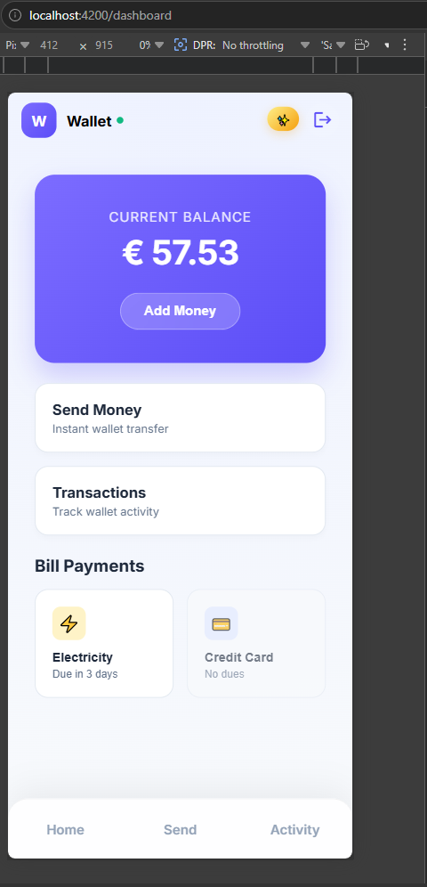
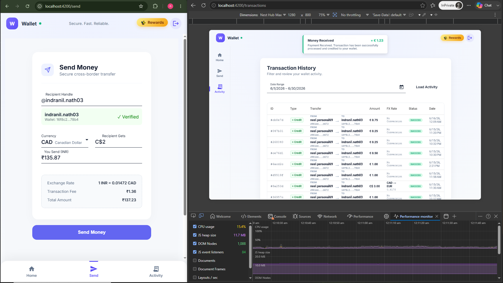
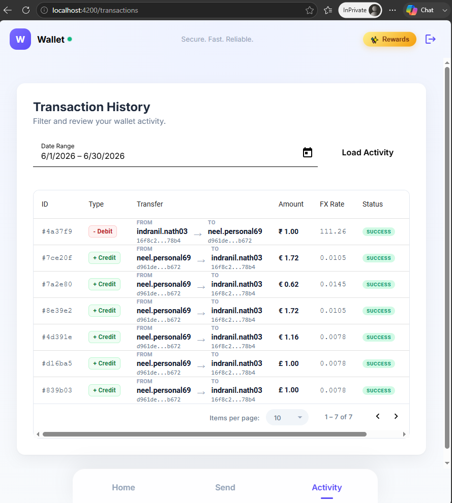
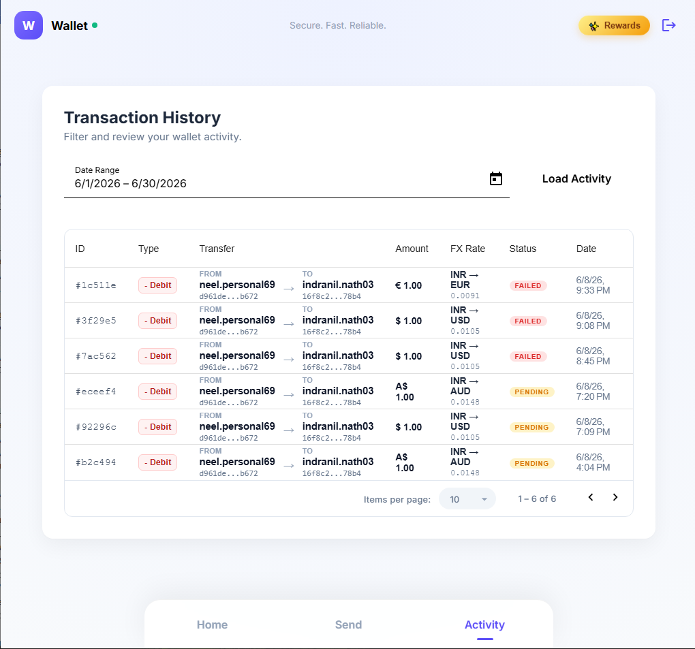

# 🌐 Real-Time Cross-Border Wallet Platform

[](https://dotnet.microsoft.com/)
[](https://angular.io/)
[](https://kafka.apache.org/)
[](https://www.postgresql.org/)
[](https://www.docker.com/)
[](https://kubernetes.io/)
[](#)

A polished, cloud-ready digital wallet prototype built for global transfers, compliant, and higher-performance money movement.

<details>
<summary><strong>👉 Table of Contents</strong></summary>

1. [Application Overview](#-application-overview)
2. [Key Technologies](#-key-technologies)
3. [Architecture & Design](#-architecture--design)
4. [Execution & Local Setup](#-execution--local-setup)
5. [Future Roadmap](#-future-roadmap)

</details>

---

## 🚀 Application Overview

This repository demonstrates a modern digital wallet ecosystem for cross-border payments, FX conversion, notifications, and real-time balance updates.

**Why this project matters for global teams:**

- Built for regulated financial environments with **GDPR-friendly** design and strong separation of concerns.
- Designed for rapid scaling with a **microservices-ready** architecture that supports Kafka, Redis, and container orchestration.
- Applies enterprise patterns such as **CQRS**, **Transactional Outbox**, and **event-driven messaging**.

**Primary capabilities:**

- Cross-currency wallet balance management
- Real-time FX quote calculation and transaction fee estimation
- Peer lookup with Redis caching
- Transaction history pagination and filtering
- Health probes for PostgreSQL, Redis, and Kafka






---

## 🧩 Key Technologies

Backend:

- [.NET 10](https://learn.microsoft.com/dotnet/core/whats-new/dotnet-10)
- [C#](https://learn.microsoft.com/dotnet/csharp/)
- [ASP.NET Core Minimal APIs](https://learn.microsoft.com/aspnet/core/fundamentals/minimal-apis)
- [Entity Framework Core](https://learn.microsoft.com/ef/core/)
- [PostgreSQL](https://www.postgresql.org/)
- [Apache Kafka](https://kafka.apache.org/)
- [Redis](https://redis.io/)
- [MediatR](https://github.com/jbogard/MediatR)
- [SignalR](https://learn.microsoft.com/aspnet/core/signalr/)
- [OpenTelemetry](https://opentelemetry.io/)
- [JWT Authentication](https://jwt.io/)
- [ML.NET (Machine Learning & Fraud Detection)](https://dotnet.microsoft.com/apps/machinelearning-ai/ml-dotnet)

Frontend:

- [Angular](https://angular.io/)
- [Angular CLI](https://angular.io/cli)
- [TypeScript](https://www.typescriptlang.org/)
- [Angular Material](https://material.angular.io/)

DevOps & Infrastructure:

- [Docker](https://www.docker.com/)
- [Docker Compose](https://docs.docker.com/compose/)
- [Kubernetes](https://kubernetes.io/)
- [Health Checks](https://github.com/Xabaril/AspNetCore.Diagnostics.HealthChecks)

---

## 🏗️ Architecture & Design

This project is organized as a domain-aware wallet platform with clear ownership boundaries and strong operational observability.

### Backend architecture

- **AI-Powered Fraud Detection (ML.NET):** Transaction payloads are evaluated in real-time by a trained machine learning model before processing. The ML.NET integration analyzes transaction patterns to identify anomalies and potentially fraudulent activities, providing automated risk assessment and significantly improving platform security without adding manual operational overhead.

- **Distributed Caching (Redis):** Frequently accessed, read-heavy data (such as supported currencies, live FX rates, and peer lookups) are served via Redis. This caching layer drastically reduces database load, improves response times, and enhances overall application scalability during high-traffic spikes.

- **Asynchronous Background Services:** Resource-intensive tasks, such as batch aggregation and notification dispatching, are offloaded from the main HTTP request-response cycle to dedicated background workers (IHostedService). By leveraging Redis as a temporary buffer, these asynchronous services effectively throttle incoming events to prevent system overload. This architecture significantly reduces server load, improves overall throughput, and ensures a highly responsive API.

- **CQRS + MediatR:** Separates reads and writes so query handlers remain fast while commands handle transactional business rules.

- **Transactional Outbox:** Ensures wallet updates and outbound events are persisted atomically to the database before publishing to Kafka, preventing data loss during network partitions.

- **Event-Driven Notifications:** Kafka decouples the core transaction flow from notification services and analytics consumers, allowing them to scale independently.

- **Session Enrichment Middleware:** Loads authenticated session context from Redis to support stateless API operation.

### Frontend design

- **Responsive Angular UI:** Intended for mobile-first and desktop-first usage with a modern dashboard pattern.
- **Live data flow:** Supports server-driven updates through WebSocket-style push notifications via SignalR.

### Compliance & globe-ready considerations

- **GDPR-conscious design:** Keeps identity and transactional metadata separate, minimizing PII exposure.
- **PSD2-ready architecture:** Aims for strong authentication boundaries and auditable event streams.
- **Resiliency-first:** Health checks and retry-aware persistence make the service suitable for global fintech teams.

---

## ⚙️ Execution & Local Setup

### Prerequisites

- [.NET 10 SDK](https://dotnet.microsoft.com/download/dotnet/10.0)
- [Node.js](https://nodejs.org/) + Angular CLI
- [Docker Desktop](https://www.docker.com/products/docker-desktop)

### Step 1: Start infrastructure

```bash
cd src
docker-compose up -d
```

### Step 2: Run the backend

```bash
cd src/services/wallet/wallet.api
dotnet ef database update
dotnet run
```

### Step 3: Run the Angular frontend

```bash
cd src/web/wallet-ui
npm install
ng serve
```

### Optional: Run unit tests

```bash
dotnet test src/tests/wallet.unittests/wallet.unittests.csproj
```

---

## 🚀 Ongoing Developments

1. **Resiliency policies:** Add [Polly](https://github.com/App-vNext/Polly) for transient fault handling.
2. **Advanced caching:** Cache FX rates and supported currencies for reduced latency.
3. **Idempotency support:** Harden payment writes for safely retryable `SendMoney` requests.
4. **Real operational telemetry:** Connect OpenTelemetry traces to a collector or observability platform.
5. **Advanced Integration & Performance Testing:** Implementing [Testcontainers](https://testcontainers.com/) for isolated, data-safe integration environments (PostgreSQL, Kafka, Redis), paired with [k6](https://k6.io/) load testing to validate high-concurrency throughput and guarantee reliability under peak traffic.
6. **GitHub CI Pipeline:** Implementing an automated Continuous Integration workflow to orchestrate the core build, test, and deployment stages. This pipeline will enforce consistent code quality, prevent regressions, and provide reliable, hands-free release automation.
6. **Kubernetes deployment:** Add Helm manifests and GitHub Actions for CI/CD.

## 🚀 Future Roadmap

6. **Add Money:** A secure payment intent via a third-party payment gateway integration (such as Stripe) to tokenize the funding source. Upon receiving a successful webhook callback, a CQRS command executes to credit the user's database ledger using Entity Framework Core.

7. **Reward funcationality:** Evaluates business rules and persists the points in an isolated rewards database. Broadcasts the updated point balance to the frontend via SignalR, enabling the UI to animate the "Rewards" element without blocking the core transaction flow.

8. **Bill payments:** Billing cycle management utilizes a scheduled background worker (like Quartz.NET) to track due dates and fetch live invoice metadata from external utility provider APIs. Processes manual or auto-pay executions using the existing transactional outbox pattern to ensure ACID-compliant wallet deductions.

---

## 📌 Notes

This repository is an excellent match for teams building financial platforms, fintech products, or wallet-based payment systems. It demonstrates modern full-stack capabilities with both backend reliability and a responsive frontend experience.